# UI Inspiration Capture: Spatial Portfolio Systems

Date: 2026-08-26

The recurring pattern is disciplined contrast: one dominant visual system, type that changes scale and anchor between chapters, sparse controls, and concrete work destinations. The useful lesson is not to add more effects. It is to make each motion event change the visitor's understanding of the work.

## 1. Lusion

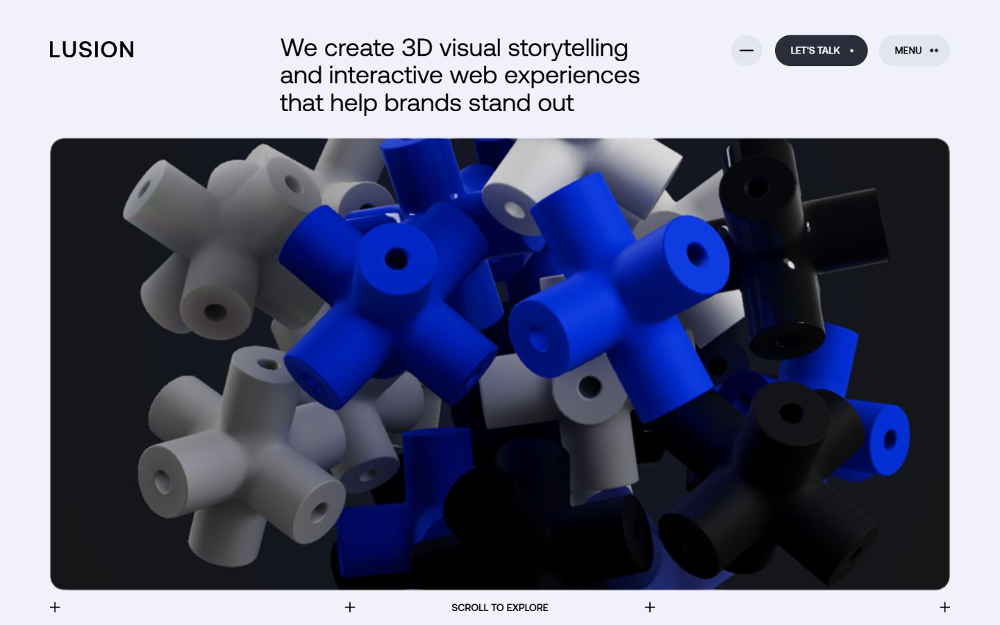

The benchmark for a persistent 3D stage. Compact controls hold while the stage and copy change spatial relationships. Local video fallback: the site uses a fixed virtual-scroll renderer and the in-app browser exposed still capture rather than local video recording.

### Full-Page And Section Evidence

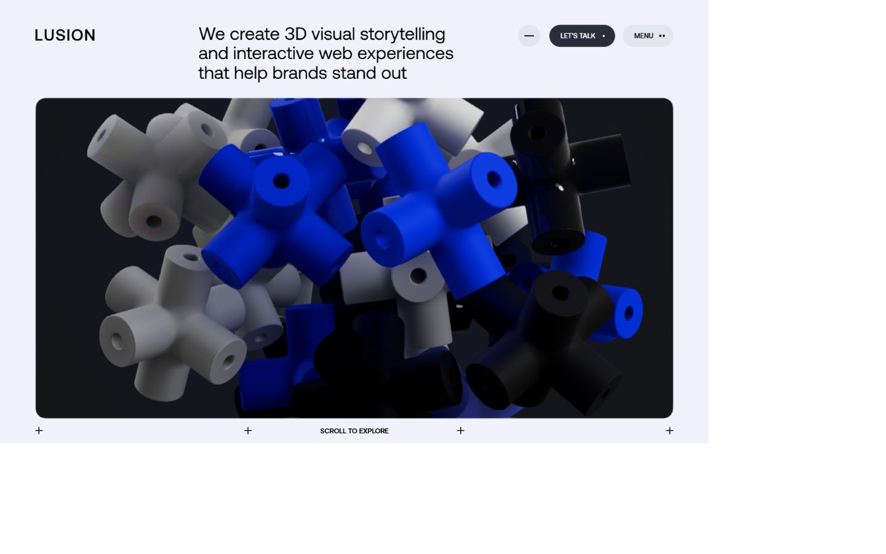

#### Section Crops

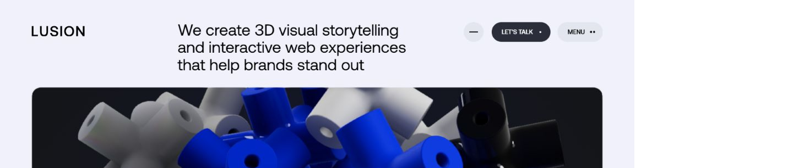

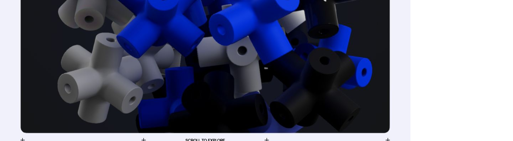

Motion progression evidence appears in the opening still above. The long builder prompt and concrete implementation notes are preserved in `manifest.json`.

## 2. Dogstudio

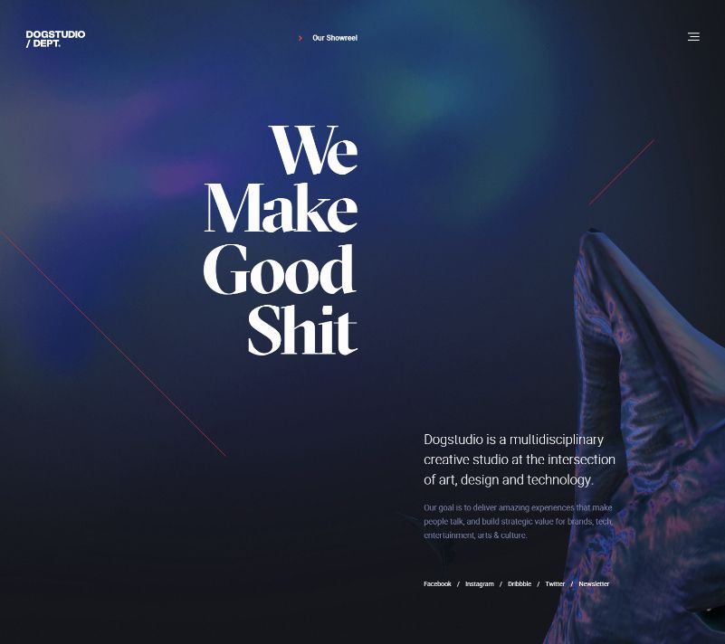

One fearless subject and one typographic collision create more identity than a page of decorative components. Local video fallback: the in-app browser did not expose a local recording surface.

### Full-Page And Section Evidence

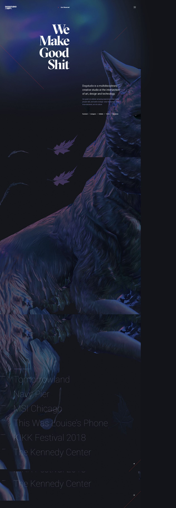

#### Section Crops

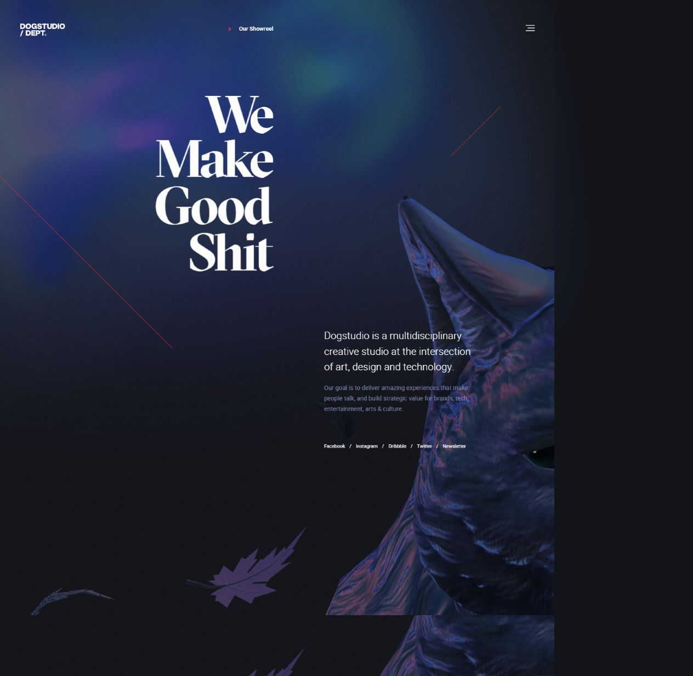

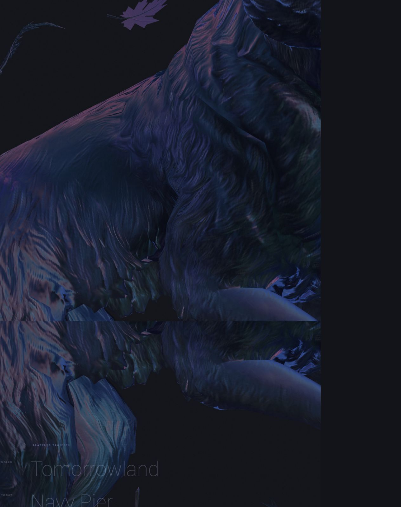

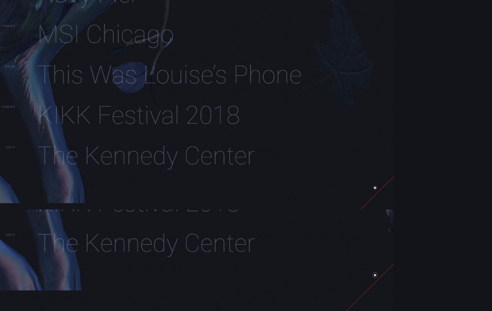

The motion opportunity is the relationship between type and a single focal subject, followed by a simpler proof sequence.

## 3. Make Me Pulse

Large words become the spatial grid while small statements attach meaning at precise coordinates. Local video fallback: the in-app browser supported local still capture but no local video export.

### Full-Page And Section Evidence

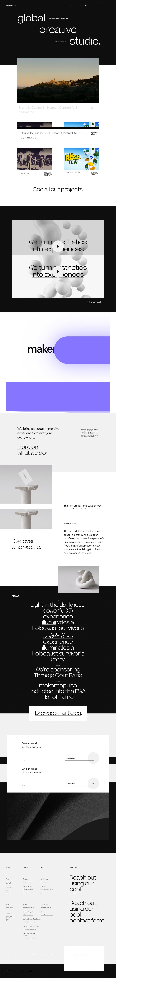

#### Section Crops

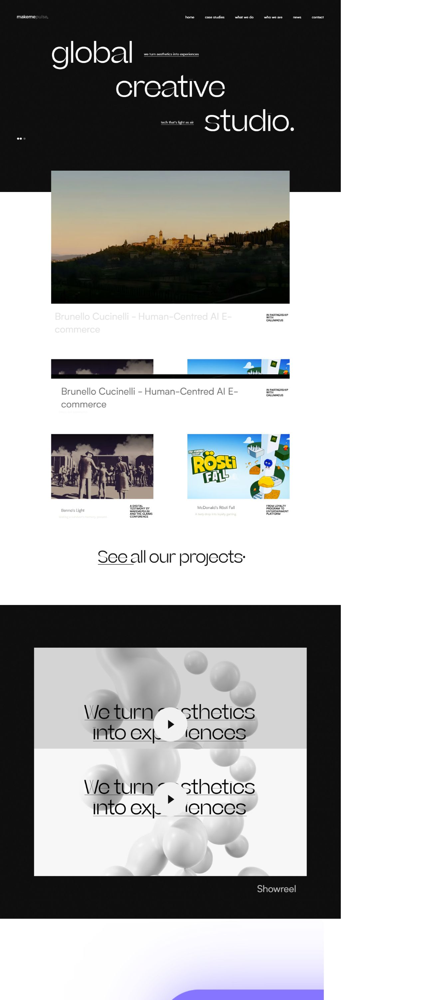

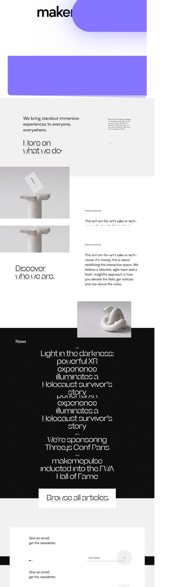

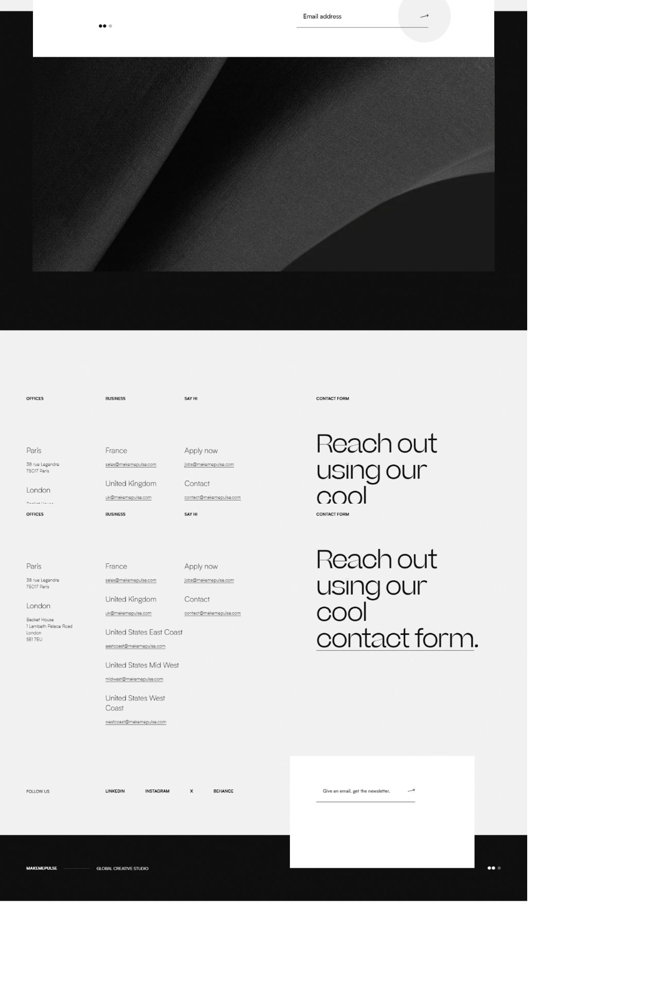

The reusable mechanism is asymmetrical reading order, not their black-and-white identity.

## 4. Cuberto

The clearest conversion reference in the set: who, what, proof, and next action stay legible despite large media. Local video fallback: the in-app browser supported full-page still capture but not local video recording.

### Full-Page And Section Evidence

#### Section Crops

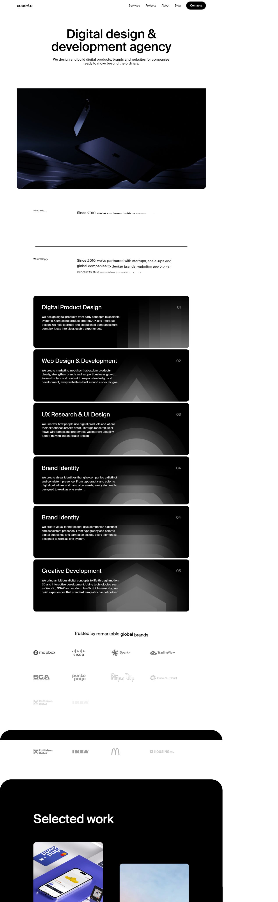

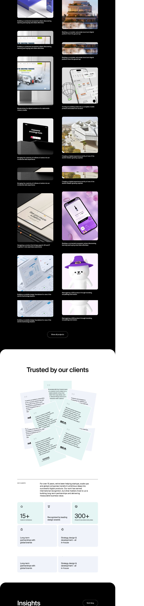

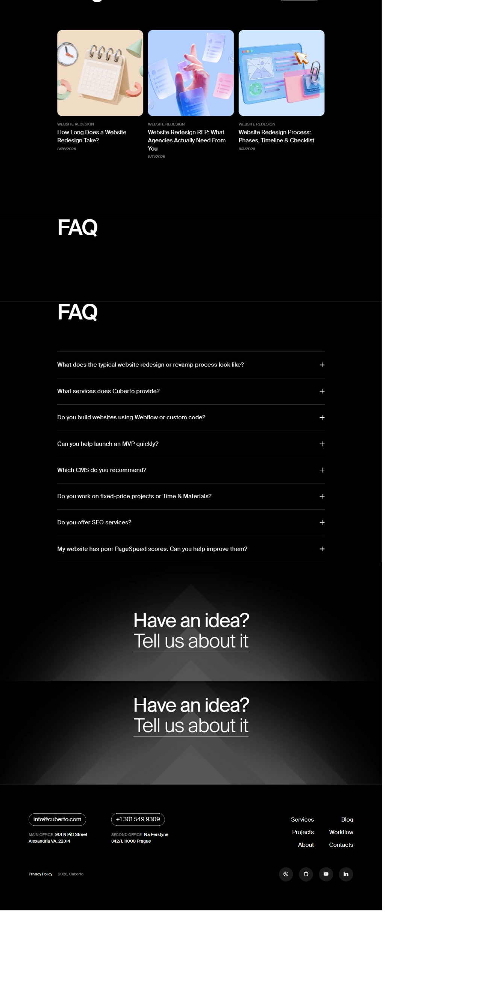

Its strongest lesson for Daniyal's portfolio is that cinematic work must still behave like a portfolio.

## 5. Locomotive

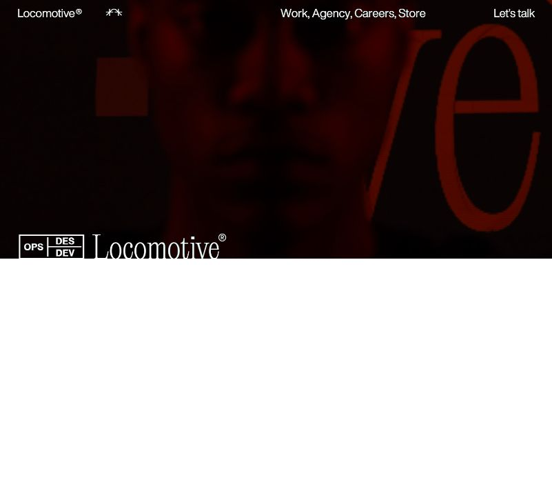

Navigation and utility copy carry recognizable personality, then section density changes between work, agency, and culture. Local video fallback: the in-app browser exposed still capture rather than local video export.

### Full-Page And Section Evidence

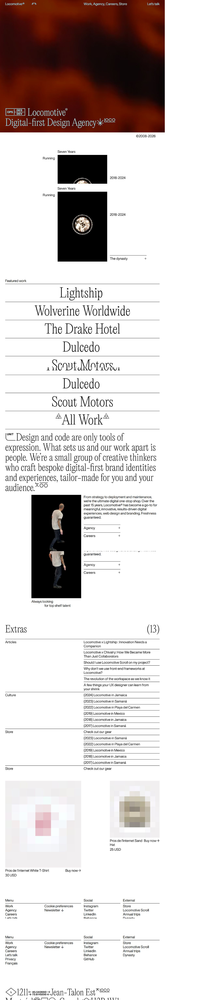

#### Section Crops

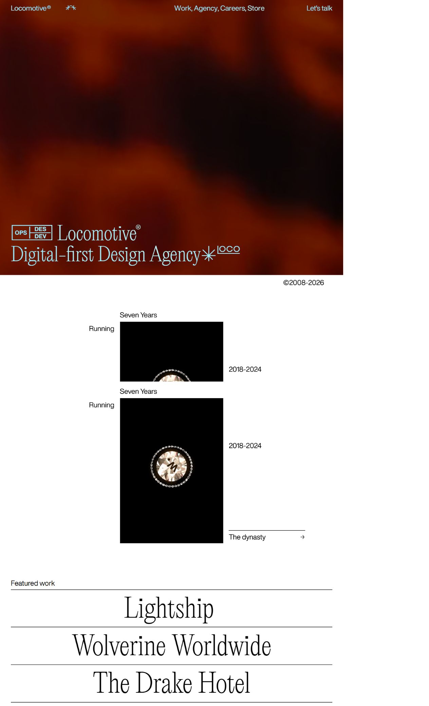

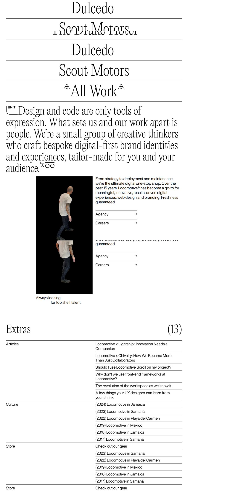

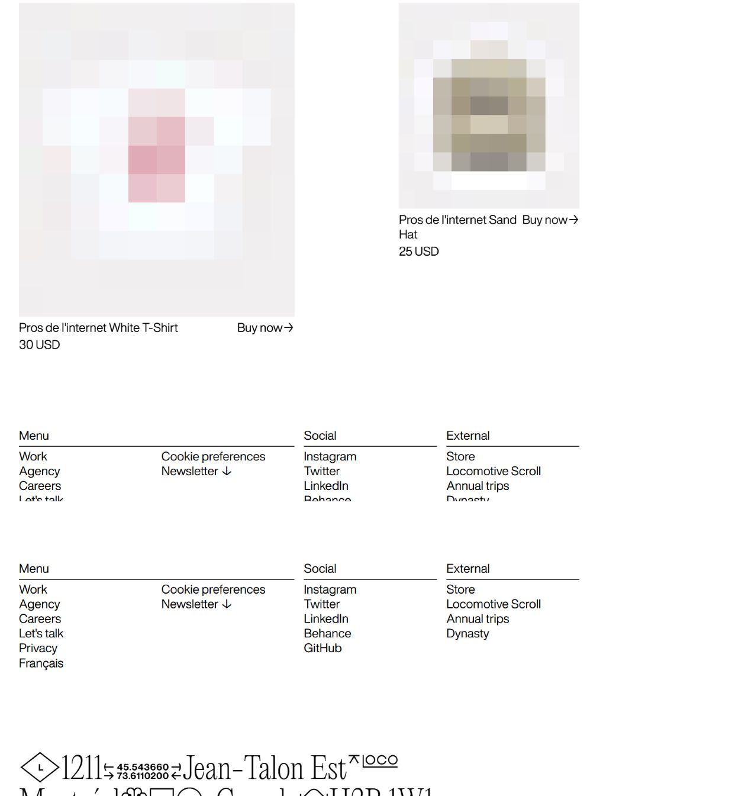

The reusable mechanism is identity-rich utility chrome and genuine pacing shifts, not their agency layout or copy.

## Why these prompts work

Each long prompt in `manifest.json` names a visual mechanism, the content hierarchy it must protect, motion timing, responsive behavior, accessibility requirements, and the reference traits that must not be copied. That keeps inspiration concrete without turning any source into a template.
